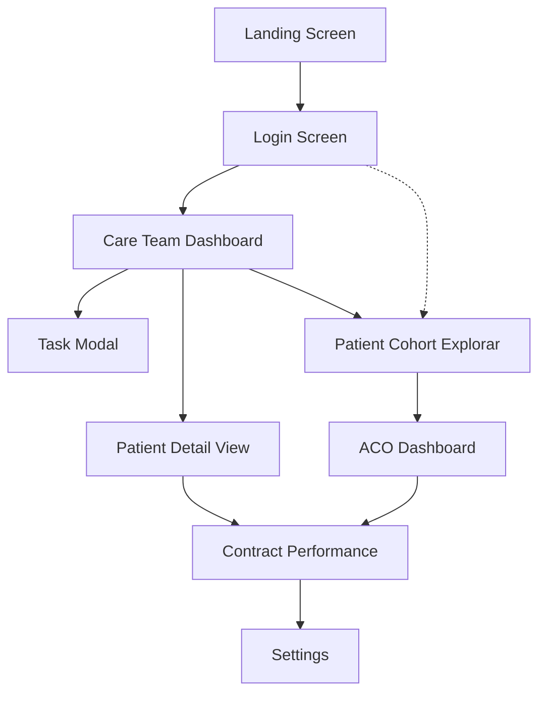

# Insync Medical Dashboard

flow: 

## Pages:

### 1. Landing Screen
- **Purpose**: Initial entry point to the application
- **Key Elements**: 
  - InSync Health branding
  - Welcome message or hero image
  - Call-to-action to login
- **Navigation**: Leads directly to Login Screen

### 2. Login Screen
- **Purpose**: User authentication and access control
- **Key Elements**:
  - Email/username input
  - Password input
  - Login button
  - Forgot password link
  - Optional: Remember me checkbox
- **Navigation**: 
  - Primary route to Care Team Dashboard
  - May provide alternative access to Patient Cohort Explorer based on role

### 3. Care Team Dashboard (InSync Health Dashboard)
- **Purpose**: Primary workspace for care team members to manage daily activities and monitor patient status
- **Key Elements**:
  - **Header**: InSync Health logo, navigation menu (Dashboard, Patients, Tasks, Alerts, Analytics), search bar, profile icon
  - **Today Section**: Date display with current day
  - **Today's Priorities**:
    - Alert for patients with worsening respiratory symptoms (count)
    - Alert for patients readmitted within 30 days (count)
  - **Patient Status Overview**:
    - High Risk Patients count (e.g., 12)
    - Medium Risk Patients count (e.g., 27)
    - Low Risk Patients count (e.g., 34)
  - **My Schedule Today**:
    - Time-based schedule with appointment types
    - Status indicators (Open, In Progress, Complete)
    - Patient names and visit details
    - Examples: Home visits, Telehealth appointments, SNF visits
  - **Recent Discharges (New to Program)**:
    - Patient name
    - Primary diagnosis (COPD, CHF, Trach, etc.)
    - Last contact date
    - Risk level indicator
    - Discharge facility
  - **My Schedule Queue (Scheduled)**: List of scheduled patients with facility and days since discharge
  - **Footer**: Version number, HIPAA Compliant badge
- **Navigation**: 
  - Access to Task Modal via Alerts
  - Links to Patient Detail View (clicking on patient names)
  - Access to Patient Cohort Explorer via Patients tab
  - Access to Analytics section

### 4. Task Modal
- **Purpose**: Detailed view and management of care team tasks
- **Key Elements**:
  - Task title and description
  - Patient associated with task
  - Priority level (High/Medium/Low)
  - Due date and time
  - Assigned team member
  - Status (Open, In Progress, Complete)
  - Action buttons (Complete, Reassign, Defer, Add Note)
  - Task history and comments section
- **Navigation**: Modal overlay that returns to Care Team Dashboard when closed

### 5. Patient Detail View
- **Purpose**: Comprehensive clinical view of individual patient information
- **Key Elements**:
  - **Tab Navigation**: Snapshot, Timeline, Clinical, Tasks, Messaging
  - **Patient Demographics Panel**:
    - Name
    - Date of Birth (ROB: xx/xxxx format)
    - Language preference
    - Risk score (COP/CHF/TRACH/VENT)
    - Current location (HOME/SNF/LTAC)
    - Next contact date
  - **Patient Journey Timeline**:
    - Visual timeline showing: Admission → Discharge → SNF Stay → LTAC Stay → ED Visit → Rehospitalization
    - Date markers for each transition
  - **Clinical Details Panel**:
    - Diagnoses list
    - Medication list
    - FEV1 score
    - GOLD Stage
    - Exacerbations
    - EF (Ejection Fraction)
    - NYHA classification
    - Weight trends
    - Equipment needs
  - **Notes Sections** (2 panels):
    - Time-stamped clinical notes
    - Chronological documentation
  - **Tasks & Interventions Panel**:
    - Active care plan
    - Completed interventions
    - Education topics provided
    - Tasks with assignment and status
  - **Messaging Panel**:
    - Internal team communication
    - Care coordination notes
- **Navigation**: 
  - Return to Care Team Dashboard
  - Links to Contract Performance
  - Access to edit patient information

### 6. Patient Cohort Explorer
- **Purpose**: Filter, search, and analyze patient populations by various criteria
- **Key Elements**:
  - **Header Navigation**: Dashboard, Patients (active), Analytics, Settings
  - **Filter Controls**:
    - Program dropdown (COPD/CHF, etc.)
    - Location dropdown (SNF, Home, LTAC, Hospital)
    - Risk level dropdown (High, Medium, Low)
    - Status dropdown (Active, Inactive, etc.)
    - Filter button
  - **Patient Data Table**:
    - Patient name (anonymized in wireframe)
    - Program assignment
    - Risk level indicator
    - Location
    - Days since discharge
    - Readmission status (Yes/No)
  - **Sorting and pagination controls**
  - **Export functionality**
- **Navigation**: 
  - Links to Patient Detail View (clicking on patient rows)
  - Access to ACO Dashboard
  - Connected to Care Team Dashboard

### 7. ACO Dashboard (Admin/ACO Dashboard)
- **Purpose**: High-level analytics and performance metrics for accountable care organization management
- **Key Elements**:
  - **Header Navigation**: Dashboard (active), Patients, Analytics, Settings
  - **Key Performance Indicators**:
    - Admissions (total count, e.g., 1,456)
    - Average Length of Stay (days, e.g., 4.3)
    - 30-Day Readmission Rate (with trend line, COPD/CHF breakdown)
    - Cost Savings (total program savings, e.g., $230K)
  - **Admissions by Diagnosis** (pie chart):
    - COPD
    - CHF
    - Trach/Vent
    - Other
  - **Notifications Panel**:
    - New readmissions with patient names
    - High-risk patient flags
    - Missing follow-ups
    - Overdue tasks
    - Missing visits with reimbursement codes
    - SNF transfers
  - **Patients at a Glance** (data table):
    - Sort, Filter, Contact controls
    - Columns: Patient, Diagnosis, Location, Risk, Last Contact, Next
    - Sample patient rows with real-time data
  - **Analytics Preview**: Small chart preview panel
- **Navigation**: 
  - Links to Contract Performance
  - Access to Patient Cohort Explorer
  - Drill-down to patient-level details

### 8. Contract Performance (ACO Contract Performance)
- **Purpose**: Detailed financial and quality metrics for value-based care contracts
- **Key Elements**:
  - **Contract Summary Table**:
    - Risk category
    - Lives (patient count)
    - Attribution date
    - Benchmark PMPM (Per Member Per Month)
  - **Financial Metrics Cards**:
    - Expenditures PMPM ($X,XXX.XX)
    - Average Risk Score (XX.XX)
    - Shared Savings ($X,XXX,XXX)
  - **Contract Period Performance Chart**:
    - Line graph showing financial performance over quarters
    - Y-axis: Dollar amounts
    - X-axis: Time periods (quarters)
  - **Performance Metrics Table**:
    - Columns: Metrics, Actual, Benchmark
    - Rows showing various quality measures
    - Metric X, Y, Z with corresponding values
  - **Stratum Breakdown**:
    - Visual representation of patient stratification
    - Stratum 1, 2, 3, 4 with distribution
- **Navigation**: 
  - Links to Settings
  - Can be accessed from Patient Detail View or ACO Dashboard
  - Return to ACO Dashboard

### 9. Settings
- **Purpose**: Application configuration, user preferences, and administrative functions
- **Key Elements**:
  - **User Profile Management**:
    - Personal information
    - Contact details
    - Role and permissions
  - **Notification Preferences**:
    - Email notifications
    - In-app alerts
    - Alert thresholds for patient risk changes
  - **Display Settings**:
    - Dashboard layout preferences
    - Default views
    - Color scheme options
  - **Security Settings**:
    - Password change
    - Two-factor authentication
    - Session timeout
  - **Team/Organization Settings** (admin only):
    - User management
    - Role definitions
    - Workflow configurations
  - **Integration Configurations**:
    - EHR connections
    - Data import/export settings
    - API access
  - **Reporting Preferences**:
    - Default report formats
    - Scheduled reports
- **Navigation**: Accessible from any main dashboard area via header navigation

## Additional Screens:

### 10. RT Workforce Analytics
- **Purpose**: Monitor respiratory therapist workforce utilization and productivity
- **Key Elements**:
  - **Header Navigation**: Dashboard, Visits, Tasks, Staffing
  - **Key Metrics Cards**:
    - Total Visits (count, e.g., 33)
    - Average Daily Visits (with trend indicator, e.g., 18)
    - Tasks Completed (count with % vs. last month, e.g., 50, ↑10%)
  - **Visits by Location** (bar chart):
    - Home
    - SNF
    - LTAC
    - Hospital
  - **Tasks Summary Panel**:
    - Tasks Assigned (count, e.g., 200)
    - Tasks Completed (count, e.g., 50)
    - Completion Rate (percentage, e.g., 25%)
  - **Active Caseload** (pie chart):
    - High risk patients
    - Medium risk patients
    - Low risk patients
    - Legend with color coding
- **Navigation**: Integrated within Staffing or Analytics section

### 11. Executive Summary
- **Purpose**: High-level overview for executive leadership and stakeholders
- **Key Elements**:
  - **Key Metrics Panel** (3 cards):
    - 30-Day Readmission Rate (percentage, e.g., 15.2%)
    - Average Length of Stay (days, e.g., 4.8)
    - Current Admissions (count, e.g., 24)
  - **Readmissions Trend** (line chart):
    - Monthly trend from Jan to Sep
    - Y-axis: Percentage (14%-23%)
    - Shows fluctuations over time
  - **Cost Savings Estimate**:
    - Large dollar figure (e.g., $185K)
    - Visual representation with horizontal bars
  - **Top Diagnoses** (horizontal bar chart):
    - COPD (longest bar)
    - CHF
    - Pneumonia
    - Stroke
- **Navigation**: Likely accessible from main Dashboard or Analytics section

### 12. Quality Metrics Dashboard
- **Purpose**: Track and display clinical quality measures and compliance
- **Key Elements**:
  - **Header Navigation**: Overview (active), Reports, Settings
  - **KPI Summary Cards**:
    - Average Length of Stay (days, e.g., 4.0)
    - 30-Day Readmission Rate (percentage, e.g., 14%)
    - Hospital Mortality Rate (percentage, e.g., 4%)
  - **Patient Outcomes Chart**:
    - Preventable Admissions trend line
    - Additional outcome metrics
  - **Compliance Metrics Section**:
    - COPD Bundle Compliance (line chart showing trend)
    - CHF Bundle Compliance (line chart showing trend)
  - **Quality Measures Table**:
    - Columns: Measure, Rate, Trend, Goal
    - Multiple rows for different quality indicators
    - Comparison of actual vs. target performance
- **Navigation**: Part of Analytics section

### 13. Quality Measure Drill-Down
- **Purpose**: Detailed analysis of specific quality measures
- **Key Elements**:
  - **Measure Overview**:
    - Large percentage display (e.g., 70% for A1c Control <8.0%)
    - Target benchmark (e.g., 75%)
  - **Performance Over Time** (bar chart):
    - Monthly progression (Jan-Feb shown)
    - Y-axis: 0%-80%
  - **Dimensional Analysis Tabs**:
    - By Provider
    - By Quarter
    - By Clinic
  - **Provider Breakdown** (horizontal bar chart):
    - Provider A through F
    - Performance comparison
  - **Audit Findings Panel**:
    - Missed Visit (18%)
    - Inaccurate Coding (21%)
    - Guideline Deviation (19%)
    - Insufficient Documentation (11%)
    - Non-Adherence (7%)
    - Other (5%)
  - **Intervention Log Table**:
    - Columns: Date, Provider, Intervention
    - Historical actions taken to improve measure
- **Navigation**: Accessed from Quality Metrics Dashboard

### 14. Bundle Compliance Audit
- **Purpose**: Track adherence to care bundle protocols
- **Key Elements**:
  - **Overall Compliance** (donut chart):
    - Percentage display (e.g., 73%)
  - **By Diagnosis Breakdown**:
    - COPD, CHF, Other
    - Individual compliance rates
    - Visual gauge showing 63%, 76%, 78%
  - **Compliance Trend Chart**:
    - Line graph from Jan to Apr
    - Y-axis: 0%-100%
    - Shows improvement over time
  - **Compliance Detail Table**:
    - Columns: Element, Compliance, Target, Patients
    - Rows for different compliance elements
    - Shows gaps between actual and target
- **Navigation**: Part of Quality/Analytics section

### 15. LOS Variance Analyzer
- **Purpose**: Analyze length of stay patterns and identify outliers
- **Key Elements**:
  - **Filter Controls**:
    - Time Period dropdown (Quarter, Month, etc.)
    - Diagnosis dropdown (COPD, CHF, etc.)
  - **Observed LOS vs. Expected LOS Panel**:
    - Observed: X.X days
    - Expected: X.X days
    - Variance calculation
  - **LOS Trend Chart**:
    - Multi-line graph showing trends over quarters (Q1-Q5)
    - Multiple series for comparison
  - **Hospital LOS Distribution** (histogram):
    - X-axis: Days (<3, 3, 4, 7+)
    - Y-axis: Patient count
  - **Variance by Diagnosis** (bar chart):
    - COPD, CHF, Pneumonia comparison
  - **Patients with Long LOS Table**:
    - Columns: Patient, Hospital, Actual LOS, Expected LOS, Variance
    - Detailed patient-level data
    - Identifies specific cases requiring review
- **Navigation**: Advanced analytics tool, likely within Analytics section

## User Roles and Access:

- **Care Team Member**: Access to Care Team Dashboard, Patient Detail View, Tasks
- **Respiratory Therapist**: RT Workforce Analytics, Task management, Patient visits
- **Care Coordinator**: Full patient management, Cohort Explorer, scheduling
- **Administrator/ACO Manager**: ACO Dashboard, Contract Performance, all analytics, Settings
- **Executive**: Executive Summary, high-level metrics, quality dashboards
- **Quality Manager**: Quality Metrics Dashboard, Drill-Downs, Audit tools, LOS Analyzer
